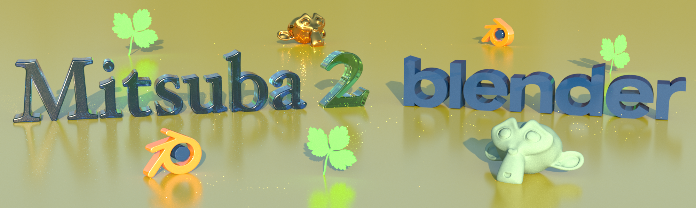

=======================

# Mitsuba 2 Blender Add-On

Author: Baptiste Nicolet.

This Add-on allows to export a Blender scene to Mitsuba 2's file format.

## How to install the Add-on

:warning: Before installing the add-on, make sure Mitsuba 2 was compiled with the **same version** of python that Blender uses (3.74 for Blender 2.82)

### Option 1: In Blender.
- Download the latest release or clone this repository as a `zip` archive.
- In Blender, go to **Edit** -> **Preferences** -> **Add-ons** -> **Install**
- Select the downloaded archive
- Enable the Add-on:
	- Point `python_path` to the directory containing **enoki** and **mitsuba** python libraries (Usually something like `/path/to/mitsuba2/build/dist/python/`). If the environment variable `PYTHONPATH` was set (cf. Mitsuba 2 install instructions), this field will automatically be filled with the path it contains.

### Option 2: Installing the Add-on from the repository.
There are a couple ways to keep up to date with the repository without doing the method described above every time:

-  Clone the add-on wherever you want in your system, and create a symbolic link to the cloned repository location in the *addons* folder of Blender. This directory is stored:
	- Linux: `$HOME/.config/blender/2.82/scripts/addons/`
  	- MacOS: `/Users/$USER/Library/Application Support/Blender/2.82/scripts/addons/`
  	- Windows: `%USERPROFILE%\AppData\Roaming\Blender Foundation\Blender\2.82\scripts\addons`
- Create a directory called `addons` in the location of your work and clone this repository there. Then specify the path to the parent folder of the `addons` directory in the preferences in Blender ( **Edit** -> **Preferences** -> **File Paths** -> **Scripts**).  For more detailed information, see [here](https://docs.blender.org/manual/en/latest/editors/preferences/addons.html#rd-party-add-ons).

Make sure you restart Blender to update the Add-on.

## How to use the Add-on

The current scene can be exported as a Mitsuba 2 scene under **File** -> **Export** -> **Mitsuba 2**

## What's supported ?

Currently, this add-on only allows you to save a Blender scene as a Mitsuba 2-compatible scene. Future versions may support more fancy features, such as custom nodes for materials or in-blender rendering.

Export of the following is supported:

- Objects:
  - Meshes
  - Metaballs
  - Text
  - Nurbs surfaces
- Material Nodes:
  - Diffuse BSDF :warning: *Mitsuba 2 does not handle rough diffuse BSDFs currently*
  - Glossy BSDF
  - Emission BSDF
  - Glass BSDF
  - Image Texture
  - Vertex Colors
  - Mix Shader
  - Add Shader :warning: *Adding two BSDFs is not supported*
- Light Sources:
  - Point Light
  - Spot Light
  - Sun Light
  - Area Lights :warning: *Ellipse area lights are not supported*
  - Environment Maps
