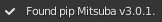

# Mitsuba Blender Add-on

This add-on integrates the Mitsuba renderer into Blender.

## Main Features

* **Mitsuba scene import**: Import Mitsuba XML scenes in Blender to edit and preview them. Materials are converted to Cycles shader node trees.

* **Mitsuba scene export**: Export a Blender scene to a Mitsuba XML scene for rendering.

More in-depth information about the features of the add-on are available on the [wiki](https://github.com/mitsuba-renderer/mitsuba-blender/wiki).

## Installation

- Download the latest release from the [release section](https://github.com/mitsuba-renderer/mitsuba-blender/releases).
- In Blender, go to **Edit** -> **Preferences** -> **Add-ons** -> **Install**.
- Select the downloaded ZIP archive.
- Find the add-on using the search bar and enable it.
- To point the add-on to the Mitsuba dependencies, either click on *Install dependencies using pip* to download the latest package, or check *Use custom Mitsuba path* and browse to your Mitsuba build directory. You can find more information on how to build Mitsuba [here](https://mitsuba.readthedocs.io/en/latest/src/developer_guide/compiling.html).

The add-on should display a checkmark once Mitsuba is correctly detected and initialized.

### Requirements

* `Blender >= 2.93`
